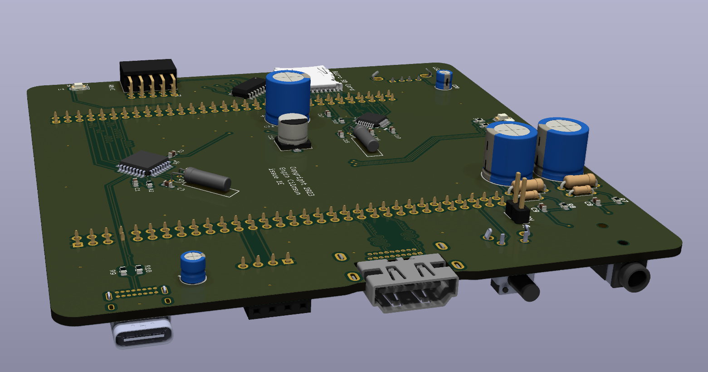

# expansionboardA

This repository contains KiCAD 7 project files for an expansion module built for QMTECH A7 200T core board.
Required libraries (models and symbols) are included with the project.

# Bill of materials

See expansionboardA.cv file for the list of components required for a fully populated board. Please note that some are optional (such as the USB controller chips) depending on your application.

# Future sections:
- Populating the board partially
- 3v3 and 5v voltage path selection
- QMTECH core board installation
- Installing tinysys bitware
- Compiling and running software on the board
