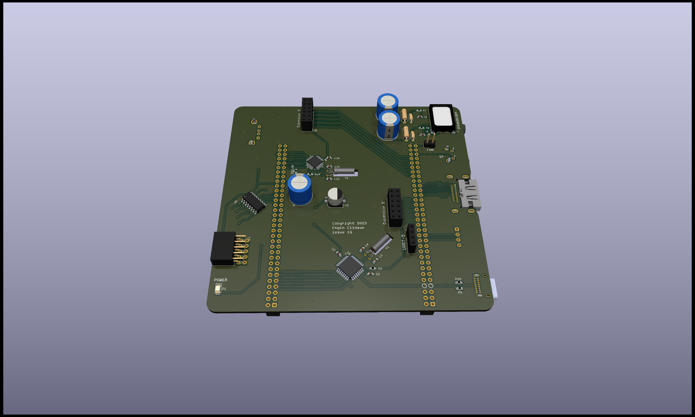

# expansionboardA

This repository contains KiCAD 7 project files for an expansion module built for QMTECH A7 200T core board.
Required libraries (models and symbols) are included with the project.

# Bill of materials

See expansionboardA.cv file for the list of components required for a fully populated board. Please note that some are optional (such as the USB controller chips) depending on your application.

# Default SoC, ROM image and samples

For hardware, visit https://github.com/ecilasun/tinysys. The project files require a recent version of Vivado suite to work.

For software, visit https://github.com/ecilasun/riscvtool and check the tinysys directory for the default ROM image and samples. The ROM image comes in two parts: the actual executable ROM and another one (fetch) that contains instruction sequences to inject on hardware/software interrupts. Samples demonstrate majority of the capabilities of the tinysys SoC itself.

# Future sections:
- Populating the board partially
- 3v3 and 5v voltage path selection
- QMTECH core board installation
- Installing tinysys bitware
- Compiling and running software on the board
